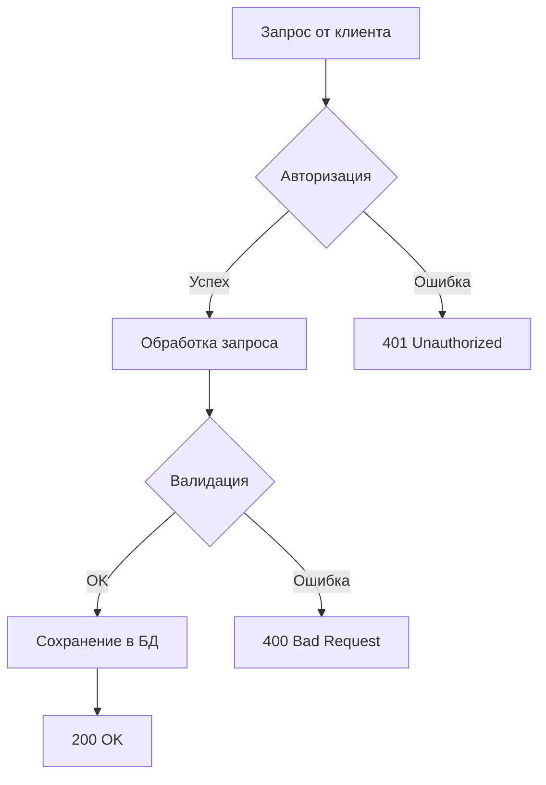
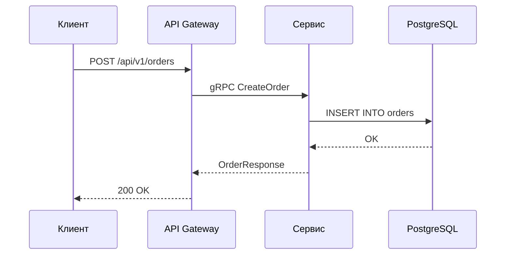

# conflugen

CLI tool that syncs Markdown files to Confluence pages using in-file directives.

Each Markdown file declares its target Confluence page via a simple HTML comment directive — similar to how `//go:generate go-enum` annotations work. Only changed pages are updated (SHA256 hash tracking).

## Install

```bash
go install github.com/VereshchaginKonstantin/conflugen@latest
```

## Quick Start

1. Add a directive to your Markdown file:

```markdown
<!-- +conflugen parent-id=603773525 space-key=OB title="Архитектура сервиса" -->

# Обзор архитектуры

Сервис состоит из следующих компонентов...
```

2. Run conflugen:

```bash
conflugen -f docs/architecture.md
```

## Directive Format

Directives are HTML comments with the `+conflugen` prefix. Place them at the top of any `.md` file:

```markdown
<!-- +conflugen parent-id=123456 space-key=OB title="Custom Title" -->
```

Or split across multiple lines:

```markdown
<!-- +conflugen parent-id=123456 space-key=OB -->
<!-- +conflugen title="Custom Title" -->
```

### Parameters

| Parameter   | Required | Description                                          |
|-------------|----------|------------------------------------------------------|
| `parent-id` | yes      | ID of the parent Confluence page                     |
| `space-key` | yes      | Confluence space key                                 |
| `title`     | no       | Page title (defaults to filename without `.md`)      |

All `<!-- +conflugen ... -->` lines are stripped from content before publishing.

## Usage

> **Important:** You must specify your Confluence URL via `--url` flag or `CONFLUENCE_URL` environment variable.
> The default value (`confluence.example.com`) is a placeholder and will not work.

```bash
# Set Confluence URL (do this once per shell session)
export CONFLUENCE_URL="https://confluence.your-company.com/rest/api"
export CONFLUENCE_TOKEN="your-token-here"

# Process specific files
conflugen -f docs/architecture.md -f docs/api.md

# Positional arguments also work
conflugen docs/architecture.md docs/api.md

# Dry run — see what would happen without making changes
conflugen -f docs/architecture.md --dry-run

# Explicit URL via flag
conflugen -f docs/architecture.md --url https://confluence.your-company.com/rest/api

# Debug mode (verbose Confluence API output)
conflugen -f docs/architecture.md --debug
```

### Flags

| Flag            | Description                                   | Default                              |
|-----------------|-----------------------------------------------|--------------------------------------|
| `-f`            | Markdown file to process (repeatable)         | —                                    |
| `--token`       | Confluence API token (or `CONFLUENCE_TOKEN`)  | —                                    |
| `--url`         | Confluence REST API URL (or `CONFLUENCE_URL`) | `https://confluence.example.com/rest/api` |
| `--dry-run`     | Preview mode, no changes                      | `false`                              |
| `--debug`       | Verbose Confluence API output                 | `false`                              |

### Troubleshooting: `dial tcp: lookup confluence.example.com: no such host`

This error means you did not set the `--url` flag. The default URL is a placeholder.

**Fix:** specify your Confluence instance URL:

```bash
# Via environment variable (recommended — set once in .env or .bashrc)
export CONFLUENCE_URL="https://confluence.your-company.com/rest/api"
conflugen -f docs/file.md

# Or via flag
conflugen -f docs/file.md --url https://confluence.your-company.com/rest/api
```

### Confluence URL

conflugen needs the REST API URL of your Confluence instance.

**How to find your Confluence URL:**

1. Open any page in your Confluence in a browser
2. Look at the address bar — the base URL is everything before `/display/`, `/pages/`, or `/spaces/`
3. Append `/rest/api` to get the API URL

Examples:

| Browser address bar                                          | `CONFLUENCE_URL` value                          |
|--------------------------------------------------------------|-------------------------------------------------|
| `https://confluence.your-company.com/display/TEAM/Page`      | `https://confluence.your-company.com/rest/api`  |
| `https://wiki.example.org/pages/viewpage.action?pageId=123`  | `https://wiki.example.org/rest/api`             |
| `https://mycompany.atlassian.net/wiki/spaces/DEV`            | `https://mycompany.atlassian.net/wiki/rest/api` |

Set it once via environment variable:

```bash
export CONFLUENCE_URL="https://confluence.your-company.com/rest/api"
```

Or in `.env` file:

```bash
CONFLUENCE_URL=https://confluence.your-company.com/rest/api
```

### Authentication

conflugen uses Confluence [Personal Access Token](https://confluence.atlassian.com/enterprise/using-personal-access-tokens-1026032365.html) (PAT) for authentication.

**How to get a token:**

1. Open Confluence → click your avatar (top right) → **Settings**
2. In the left menu select **Personal Access Tokens**
3. Click **Create token**
4. Enter a name (e.g. `conflugen`), set expiration, click **Create**
5. Copy the token (it is shown only once)

**How to provide the token to conflugen:**

Option 1 — environment variable (recommended):

```bash
export CONFLUENCE_TOKEN="your-token-here"
conflugen -f docs/architecture.md
```

Option 2 — `.env` file (add to `.gitignore`!):

```bash
# .env
CONFLUENCE_URL=https://confluence.your-company.com/rest/api
CONFLUENCE_TOKEN=your-token-here
```

```bash
# use with env loading
source .env && conflugen -f docs/architecture.md
```

Option 3 — CLI flag (not recommended for shared environments):

```bash
conflugen -f docs/architecture.md --token "your-token-here"
```

In `--dry-run` mode, no token is required.

## Makefile Integration

### Install target (like go-enum)

Add an install target to your Makefile, similar to how `go-enum` is installed:

```makefile
CONFLUGEN_VERSION ?= latest

.PHONY: install-conflugen
install-conflugen:
	go install github.com/VereshchaginKonstantin/conflugen@$(CONFLUGEN_VERSION)
```

### Generate docs target

```makefile
.PHONY: generate-docs
generate-docs: install-conflugen
	conflugen \
		-f docs/architecture.md \
		-f docs/api-reference.md \
		-f docs/runbook.md
```

### Full example (go-enum + conflugen)

```makefile
GO_ENUM_VERSION ?= v0.6.0
CONFLUGEN_VERSION ?= latest

# --- Install tools ---

.PHONY: install-goenum
install-goenum:
	go install github.com/abice/go-enum@$(GO_ENUM_VERSION)

.PHONY: install-conflugen
install-conflugen:
	go install github.com/VereshchaginKonstantin/conflugen@$(CONFLUGEN_VERSION)

.PHONY: bin-deps
bin-deps: install-goenum install-conflugen

# --- Generate ---

.PHONY: generate-enums
generate-enums: install-goenum
	go-enum -f internal/pkg/worker/types.go --nocase --marshal --sql

.PHONY: generate-docs
generate-docs: install-conflugen
	conflugen \
		-f docs/architecture.md \
		-f docs/api-reference.md \
		-f docs/runbook.md

.PHONY: generate-docs-dry
generate-docs-dry: install-conflugen
	conflugen --dry-run \
		-f docs/architecture.md \
		-f docs/api-reference.md

.PHONY: generate
generate: generate-enums generate-docs
```

### Usage

```bash
# Install conflugen
make install-conflugen

# Publish docs to Confluence
make generate-docs

# Dry run (preview without changes)
make generate-docs-dry

# All generation (enums + docs)
make generate
```

## Supported Markdown Features

- **GitHub Flavored Markdown** (GFM) — tables, strikethrough, task lists
- **Fenced code blocks** → Confluence `code` macro with language highlighting
- **PlantUML** — ` ```plantuml ` blocks → Confluence PlantUML macro
- **Mermaid** — ` ```mermaid ` blocks → Confluence Mermaid macro
- **Spoilers** — `<details><summary>` → Confluence `ui-expand` macro
- **Links** — automatic conversion to Confluence link format

### Mermaid Diagrams

Mermaid diagrams in fenced code blocks are automatically converted to the Confluence Mermaid macro.
Requires the [Mermaid Chart](https://marketplace.atlassian.com/apps/1224722/mermaid-charts-for-confluence) plugin installed on your Confluence instance.

**Flowchart:**

````markdown

````

**Sequence diagram:**

````markdown

````

## How It Works

1. Reads each specified `.md` file
2. Parses `<!-- +conflugen ... -->` directives
3. Strips directives from content
4. Converts Markdown to Confluence Storage Format (HTML/XML)
5. Computes SHA256 hash of the HTML content
6. Creates or updates the Confluence page (skips if hash matches)
7. Appends a footer with "auto-generated" note and hash for change detection

### Inline Comment Preservation

When updating an existing page, conflugen preserves inline comments (text highlight + comment) that were added in the Confluence UI. Since the page content is fully replaced, inline comments lose their text anchors. conflugen handles this by:

1. Reading all inline comments from the page before the update
2. Updating the page content
3. Re-creating saved comments as regular page comments with the original quoted text

Each restored comment includes the author name, the original highlighted text (as a blockquote), and the comment body:

> **[Комментарий от Author Name, перенесён conflugen]:**
> > highlighted text fragment
>
> comment body

## Change Detection

Each published page includes a hidden hash macro:

```
conflugen-hash:<sha256>
```

On subsequent runs, conflugen compares the hash — if content hasn't changed, the page is skipped. This prevents unnecessary version bumps in Confluence.
