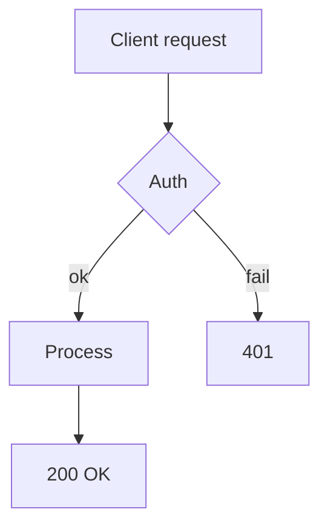
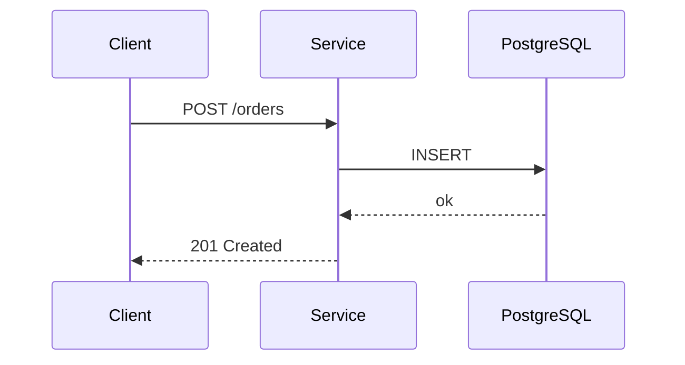
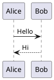

# conflugen — Markdown formatting guide

This document covers everything conflugen does **inside** a Markdown file:
which Markdown features it understands, how diagrams are rendered, how
multi-column layouts work, and how content can be composed from includes
and substituted via macros.

For install / CLI / authentication / CI integration see [README](../README.md).
For a runnable demo using every feature on one page see
[`docs/examples/showcase.md`](examples/showcase.md).

---

## Supported Markdown features

| Feature                 | Source                              | Confluence output                                       |
|-------------------------|-------------------------------------|---------------------------------------------------------|
| GFM tables              | `| col | col |\n|-----|-----|`      | `<table>` / `<thead>` / `<tbody>`                       |
| GFM strikethrough       | `~~text~~`                          | `<del>text</del>`                                       |
| GFM task lists          | `- [x]`, `- [ ]`                    | Native `<ac:task-list>` macro (clickable, state-bearing) |
| Fenced code             | ` ```lang `                         | Confluence `code` macro with language highlighting      |
| Headings                | `# H1` … `###### H6`                | `<h1>` … `<h6>` (auto-id on)                            |
| Links                   | `[text](url)`                       | `<a>` / `<ac:link>` depending on target                 |
| Inline code             | `` `code` ``                        | `<code>`                                                |
| Bold / italic           | `**bold**` / `*italic*`             | `<strong>` / `<em>`                                     |
| Block quotes            | `> quote`                           | `<blockquote>`                                          |
| Hard line breaks        | two trailing spaces / `<br/>`       | `<br/>`                                                 |
| HTML passthrough        | raw `<ac:…>` macros                 | preserved as-is (un-escaped after goldmark)             |

All formatting below is layered **on top of** these primitives.

### Task lists

GFM-style task lists become Confluence's native task macro — they stay
clickable in the page and Confluence preserves the checked/unchecked state
between conflugen re-publishes.

```markdown
- [x] write the spec
- [ ] ship
```

becomes

```xml
<ac:task-list>
  <ac:task>
    <ac:task-id>1</ac:task-id>
    <ac:task-uuid>…</ac:task-uuid>
    <ac:task-status>complete</ac:task-status>
    <ac:task-body>write the spec</ac:task-body>
  </ac:task>
  <ac:task>…incomplete…</ac:task>
</ac:task-list>
```

UUIDs are derived from each task's body (sha256-based), so re-publishing
the same source yields the same UUIDs and Confluence does not lose the
checkmarks users clicked in the UI. Editing a task's text changes its
UUID — Confluence treats it as a new task. A `<ul>` is converted to
`<ac:task-list>` only if **every** direct `<li>` starts with a checkbox
`<input>`; mixed lists keep regular `<ul>` and use Unicode ☑/☐ as a
fallback marker.

---

## Diagrams

### Mermaid (`mermaid-cloud` macro)

Mermaid diagrams in ` ```mermaid ` fences are rendered to SVG locally via
[`beautiful-mermaid`](https://www.npmjs.com/package/beautiful-mermaid)
(pure-JS, elkjs-based — **no browser / Chromium**) and uploaded as page
attachments. conflugen then inserts a `mermaid-cloud` macro pointing to
the attachment.

> If `node` or `beautiful-mermaid` is unavailable, conflugen prints a
> warning and skips SVG rendering — the mermaid source still gets
> uploaded; the diagram simply may not render until the SVG is present.

#### Setup

1. Install Node.js (v20+):

```bash
# macOS
brew install node

# Ubuntu/Debian
curl -fsSL https://deb.nodesource.com/setup_20.x | sudo -E bash -
sudo apt-get install -y nodejs
```

2. Install `beautiful-mermaid` in the directory you run conflugen from
   (it is resolved relative to the current working directory):

```bash
npm install beautiful-mermaid
```

3. Verify it renders:

```bash
echo 'flowchart TD
  A --> B' | node --input-type=module -e \
  "import {readFileSync} from 'node:fs'; const bm = await import(await import.meta.resolve('beautiful-mermaid')); process.stdout.write((await bm.renderMermaidSVGAsync(readFileSync(0,'utf8'))).slice(0,40))"
```

4. Install the [Mermaid Chart](https://marketplace.atlassian.com/apps/1224722/mermaid-charts-for-confluence)
   plugin on your Confluence instance — it renders the `mermaid-cloud`
   macro from the uploaded SVG/source.

#### Examples

**Flowchart:**

````markdown

````

**Sequence diagram:**

````markdown

````

#### Supported diagram types

The local SVG renderer (`beautiful-mermaid`) covers the most common subset
of Mermaid; everything else still becomes a `mermaid-cloud` macro with the
source uploaded as an attachment, but the SVG preview is skipped (you'll
see a warning in conflugen's stderr).

| Mermaid type        | Header keyword             | Renders to SVG locally |
|---------------------|----------------------------|:----------------------:|
| Flowchart / graph   | `flowchart …`, `graph …`   | ✅                      |
| Sequence            | `sequenceDiagram`          | ✅                      |
| Class               | `classDiagram`             | ✅                      |
| State (v2)          | `stateDiagram-v2`          | ✅                      |
| Entity-relationship | `erDiagram`                | ✅                      |
| Gantt               | `gantt`                    | ❌ (source only)        |
| Pie                 | `pie`                      | ❌ (source only)        |
| Journey             | `journey`                  | ❌ (source only)        |
| Mindmap             | `mindmap`                  | ❌ (source only)        |
| Git graph           | `gitGraph`                 | ❌ (source only)        |

For the “source only” types: the page still gets a `mermaid-cloud` macro
pointing at the uploaded source file. If your Confluence has the
[Mermaid Chart](https://marketplace.atlassian.com/apps/1224722/mermaid-charts-for-confluence)
plugin and it falls back to server-side rendering when the SVG is missing,
the diagram may still display. Otherwise you'll see the macro placeholder.

If you need local SVG for one of the unsupported types, swap the renderer
(e.g. for `mmdc` from mermaid-cli, which supports all Mermaid types but
requires a headless browser) — `extensions/mermaid_render.go` is the
integration point.

#### Pipeline

1. conflugen finds ` ```mermaid ` blocks
2. Renders each diagram to SVG via `beautiful-mermaid`
3. Uploads source + SVG as page attachments
4. Inserts `mermaid-cloud` macro referencing the attachment

### PlantUML

` ```plantuml ` fences become a Confluence PlantUML macro. The source is
embedded directly; the Confluence-side PlantUML plugin does the rendering.

````markdown

````

---

## Images

`` with a **relative path** to a local file is uploaded as a
page attachment and rendered as a native Confluence image:

```markdown

```

→

```xml
<ac:image ac:alt="Architecture diagram">
  <ri:attachment ri:filename="architecture.png" />
</ac:image>
```

Rules:

- Paths are resolved **relative to the directory of the `.md` file** that
  carries the `+conflugen` directive (not the CWD where conflugen runs).
- If the file is missing on disk, conflugen prints a warning and leaves the
  default `` (Confluence will show a broken image — that's the
  signal to fix the path).
- Subdirectories are fine (`diagrams/foo.png`); only the **basename** is
  used as the attachment name on the Confluence page. If two images on the
  same page share the same basename, the second one overwrites the first —
  rename one of them.
- URL-encoded paths (`my%20pic.png` for `my pic.png`) are decoded before
  resolution.
- **External URLs** (`http://`, `https://`, `//host/…`, `data:…`) are left
  alone — Confluence accepts them as plain `` in storage format.

---

## Spoilers (collapsible blocks)

Standard HTML `<details>` / `<summary>` → Confluence `ui-expand` macro:

```markdown
<details>
<summary>Click to expand</summary>

Hidden content — full Markdown works in here.

</details>
```

---

## Code blocks

Any fenced code block with a language hint becomes a Confluence `code`
macro with syntax highlighting:

````markdown
```go
func Hello() string {
    return "world"
}
```
````

Fences without a language stay as plain `<pre><code>` blocks.

---

## Layout blocks (columns)

Multi-column Confluence layout (`<ac:layout>` / `<ac:layout-section>` /
`<ac:layout-cell>`) is authored with pandoc-style `:::` fenced blocks:

```markdown
::: columns type=two_equal
::: cell
Left column — plain **markdown**: `[[Page]]` links, lists, code, spoilers.
:::
::: cell
Right column.
:::
:::
```

- `::: columns [type=<type>]` opens a section, `::: cell` opens a cell,
  bare `:::` closes the innermost open block.
- `type=` is optional; if omitted it is inferred from cell count
  (1 → `single`, 2 → `two_equal`, 3 → `three_equal`).
- Valid types: `single`, `two_equal`, `two_left_sidebar`, `two_right_sidebar`,
  `three_equal`, `three_with_sidebars`.
- If a page contains at least one `::: columns`, the **whole body** is wrapped
  in a single `<ac:layout>` (free content between sections is auto-grouped
  into `single`-cell sections) — Confluence requires this.
- Nested `::: columns` is **not supported** by Confluence; conversion fails
  with a clear error. Unbalanced or misplaced fences fail the same way.

Pages without any `:::` blocks render flat — zero regression for existing docs.

---

## Includes — composing a page from fragments

```markdown
<!-- +conflugen-include _shared/header.md -->
```

The line is replaced with the file's content **before** directive parsing
and goldmark. Includes are recursive (paths are relative to the **including**
file's directory) with cycle detection.

```
docs/
├── _shared/
│   ├── header.md
│   └── footer.md
└── architecture.md  ← <!-- +conflugen-include _shared/header.md -->
```

Errors fail the conversion with the offending path: missing file, cycle, etc.

> Directives in included files (`+conflugen parent-id=…`,
> `+conflugen-use box`, …) are honoured — the include happens before
> directive parsing, so children can contribute params and macros.

---

## Macros — regex → Confluence storage XML

Two ways to substitute pieces of text with raw Confluence storage XML.

### 1. User-defined macro

```markdown
<!-- +conflugen-macro \bPROJ-\d+\b => <ac:structured-macro ac:name="jira"><ac:parameter ac:name="key">$0</ac:parameter></ac:structured-macro> -->

Investigating PROJ-451 (linked automatically).
```

- Syntax: `<!-- +conflugen-macro PATTERN => TEMPLATE -->`.
- `PATTERN` is a Go regex; `TEMPLATE` supports `$0` (whole match),
  `$1`, `$2`, … (capture groups), and `${name}` (named groups).
- Applied to raw markdown **before** goldmark; the produced XML passes
  through to the final storage format unchanged.

### 2. Stdlib packs (`+conflugen-use NAME`)

Opt-in shortcuts for common macros. Enable each pack with one directive at
the top of the file:

| Pack       | Directive                                   | Syntax in body                                       | Becomes                                              |
|------------|---------------------------------------------|------------------------------------------------------|------------------------------------------------------|
| `toc`      | `<!-- +conflugen-use toc -->`               | `[[toc]]`                                            | `<ac:structured-macro ac:name="toc"/>`               |
| `jira`     | `<!-- +conflugen-use jira project=PLAT -->` | `PLAT-42`                                            | `<ac:structured-macro ac:name="jira">…</…>`          |
| `status`   | `<!-- +conflugen-use status -->`            | `[status:Green Done]`                                | `<ac:structured-macro ac:name="status">…</…>`        |
| `box`      | `<!-- +conflugen-use box -->`               | `[info: text]` / `[tip:]` / `[note:]` / `[warning:]` | `<ac:structured-macro ac:name="info">…</…>`          |

- `jira` defaults to `project=JIRA` if no `project=…` is provided.
- For **multiline** callouts in `box`, write the raw `<ac:structured-macro>`
  directly — stdlib macros are single-line.
- Status colour values follow Confluence's capitalised palette:
  `Grey`, `Red`, `Yellow`, `Green`, `Blue`, `Purple`.

---

## Raw Confluence storage macros (passthrough)

Any raw `<ac:…>` / `<ri:…>` XML you put in the markdown is preserved. This is
the escape hatch for any macro that doesn't have a dedicated wrapper:

```markdown
<ac:structured-macro ac:name="toc" ac:schema-version="1"/>

<ac:structured-macro ac:name="children" ac:schema-version="2">
  <ac:parameter ac:name="depth">2</ac:parameter>
</ac:structured-macro>
```

goldmark normally escapes such tags as `&lt;ac:…&gt;`; conflugen un-escapes them
back in a post-processing pass, and unwraps any `<p>…</p>` that contains an
`<ac:` (since Confluence's storage XHTML parser dislikes the implicit wrap).

---

## Caveat — directives are recognised anywhere

`+conflugen-include`, `+conflugen-macro` and `+conflugen-use` are matched on
the **raw source** before goldmark parses it, so they are picked up even
inside fenced code blocks and inline backticks. If you publish a page that
needs to **show** a literal directive sample (a how-to / cookbook page),
escape it — e.g. drop the leading `!` in `<!--`, replace with HTML entities
in body text, or split the comment across lines so the regex doesn't match.

This file (`FORMATTING.md`) and `docs/examples/_shared/*.md` therefore
**should not be published** through conflugen — they contain literal
directive samples that would self-trigger. They are docs about conflugen,
not docs for Confluence.

## Pipeline order

When conflugen processes a file:

1. **Includes expanded** (`+conflugen-include …`) — recursively, before anything else.
2. **Macros collected** (`+conflugen-macro …` and `+conflugen-use …`) — directives stripped.
3. **Directives parsed** (`+conflugen parent-id=…`, `label=…`, …) — directives stripped, page metadata derived.
4. **Macros applied** — regex substitutions run on the cleaned body.
5. **goldmark** converts Markdown → HTML.
6. **`<ac:…>` un-escaping** — raw Confluence macros restored.
7. SHA256 hash + auto-generated footer appended.

This ordering means: includes can carry macro definitions; macros can produce
storage XML; everything reaches Confluence as canonical storage format.
