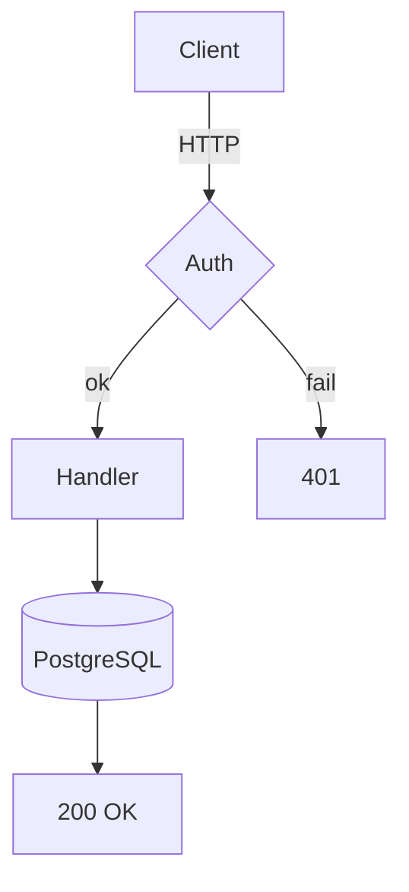
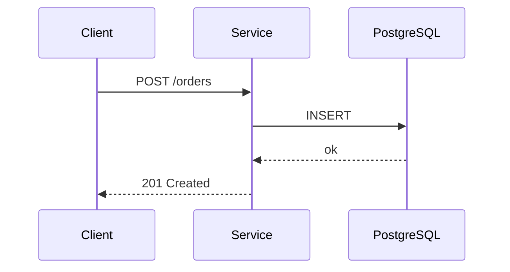
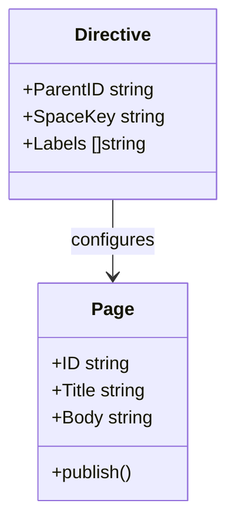
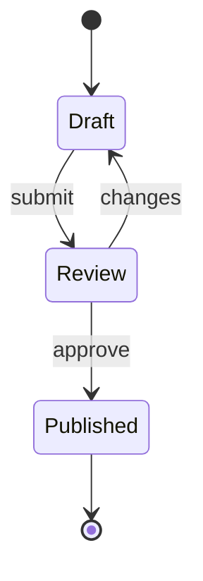
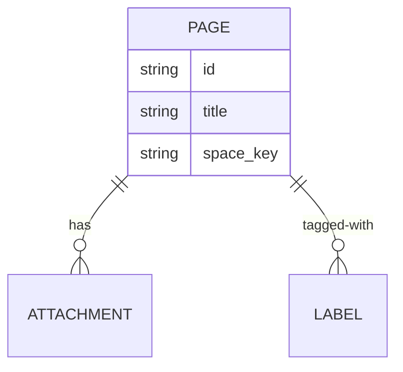
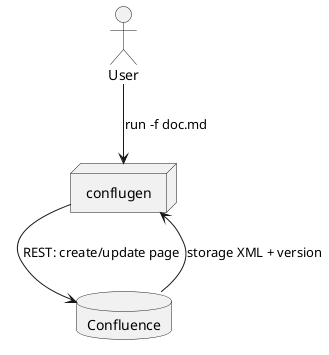

<!--
  ============================================================
  conflugen showcase — exercises every Markdown feature on one page.
  ============================================================

  Use this file as:
    * a smoke test for your Confluence integration
      (run conflugen on it with your real --url / --token);
    * a copy-paste reference for what conflugen supports;
    * a dry-run target:
        conflugen -f docs/examples/showcase.md --dry-run

  Set the parent-id below to a real page in your space before publishing.
  ============================================================
-->

<!-- +conflugen parent-id=REPLACE_ME space-key=DEMO title="conflugen showcase" -->
<!-- +conflugen label=conflugen label=showcase label=demo -->
<!-- +conflugen content-appearance=full-width -->

<!-- +conflugen-use toc -->
<!-- +conflugen-use status -->
<!-- +conflugen-use box -->
<!-- +conflugen-use jira project=DEMO -->

<!-- +conflugen-macro :tada: => <ac:emoticon ac:name="smile" ac:emoji-shortname=":tada:" ac:emoji-fallback="🎉"/> -->

# conflugen showcase

<!-- +conflugen-include _shared/header.md -->

This page demonstrates every supported feature on a single page. If anything
on the rendered Confluence page looks wrong, conflugen has a regression.

[[toc]]

---

## 1. Basic text formatting

Paragraphs separate by a blank line and **stay paragraphs**. Inline styles:
**bold**, *italic*, ***bold-italic***, ~~strikethrough~~, `inline code`,
and a [regular link](https://example.com) and an automatic URL
<https://example.com/auto>.

A hard line break uses two trailing spaces  
like this — the line above ends with two spaces.

> A block quote.
> Second line of the same quote, with **inline formatting**.
>
> > Nested block quote.

---

## 2. Lists

### Bullets

- one
- two
  - nested
  - deeper
    - deepest
- three

### Numbered

1. first
2. second
   1. nested
   2. nested
3. third

### Task list (GFM)

- [x] write the spec
- [x] implement
- [ ] ship
- [ ] celebrate :tada:

---

## 3. Tables (GFM)

| Feature        | Source                    | Outcome                                    |
|----------------|---------------------------|--------------------------------------------|
| Tables         | pipe syntax               | Confluence `<table>`                       |
| Code blocks    | triple-backtick fence     | Confluence `code` macro w/ highlighting    |
| Mermaid        | ` ```mermaid ` fence      | `mermaid-cloud` macro + uploaded SVG       |
| PlantUML       | ` ```plantuml ` fence     | Confluence PlantUML macro                  |
| Spoilers       | `<details><summary>`      | `ui-expand` macro                          |
| Layout columns | `::: columns / ::: cell`  | `ac:layout-section` / `ac:layout-cell`     |

Alignment:

| Left  | Centre | Right |
|:------|:------:|------:|
| a     |   b    |     c |
| short | mid    |  long |

---

## 4. Code blocks

```go
// Go — with syntax highlighting.
package main

import "fmt"

func main() {
    fmt.Println("hello, conflugen")
}
```

```bash
# Bash
set -euo pipefail
conflugen -f docs/examples/showcase.md --dry-run
```

```json
{
  "tool": "conflugen",
  "supports": ["markdown", "confluence"],
  "round_trip": false
}
```

```
plain fence with no language —
stays as a generic preformatted block.
```

---

## 5. Spoilers (collapsible blocks)

<details>
<summary>How does the include directive work?</summary>

The `+conflugen-include` directive (an HTML comment with a file path)
is replaced with the file's content **before** directive parsing and
goldmark — so headers, macros, and even other directives in the included
file are picked up normally. See [FORMATTING.md](../FORMATTING.md#includes--composing-a-page-from-fragments)
for the exact syntax.

</details>

<details>
<summary>Multiple paragraphs work too</summary>

First paragraph inside the spoiler.

Second paragraph — bullet lists work, **bold** works:

- one
- two

</details>

---

## 6. Layout — multi-column sections

Free content above the first `::: columns` block is automatically wrapped in a
`single`-cell section so the whole body lives inside one top-level `ac:layout`.

::: columns type=two_equal
::: cell

### Left column

Standard Markdown — **bold**, lists, links, code:

```python
print("two-equal layout, left cell")
```

:::
::: cell

### Right column

A spoiler nested in a cell:

<details>
<summary>I am inside a layout-cell</summary>

…and I render just like a top-level spoiler.

</details>

:::
:::

A paragraph between sections gets its own `single`-cell wrapper automatically.

::: columns type=three_equal
::: cell

#### Discover

[status:Blue WIP]

:::
::: cell

#### Build

[status:Yellow Review]

:::
::: cell

#### Ship

[status:Green Done]

:::
:::

::: columns type=two_right_sidebar
::: cell

### Main content (wide)

The wider cell holds the body, the narrow cell holds the navigation / call-outs.
Confluence's `two_right_sidebar` layout: cells are not equal — the second cell is the sidebar.

:::
::: cell

#### Sidebar

[info: Tip — sidebars are great for TL;DR boxes.]

:::
:::

---

## 7. Diagrams

### Mermaid — flowchart



### Mermaid — sequence



### Mermaid — class



### Mermaid — state



### Mermaid — ER



> **Note.** Showcase intentionally uses only the diagram types supported by
> the current SVG renderer (`beautiful-mermaid`): flowchart, sequence, class,
> state, ER. Types like `gantt`, `pie`, `mindmap`, `journey`, `gitGraph`
> still work as *sources* — the `mermaid-cloud` macro is created and the
> source is uploaded as an attachment — but no SVG preview is rendered
> locally. See [FORMATTING.md](../FORMATTING.md#mermaid-mermaid-cloud-macro)
> for the supported-types matrix.

### PlantUML



---

## 8. Macros — substitution to storage XML

### Stdlib pack: `box` (info / tip / note / warning)

[info: This is an info callout produced by the `box` stdlib pack.]

[tip: One-liner tip — multiline callouts need raw storage XML, see FORMATTING.md.]

[note: Just a note.]

[warning: Watch out — single-line only at the moment.]

### Stdlib pack: `status`

[status:Green Done] &nbsp; [status:Red Blocked] &nbsp; [status:Yellow Review]

### Stdlib pack: `jira` (auto-link tickets)

A bug like DEMO-123 turns into a JIRA macro because the `jira` stdlib pack
was enabled at the top of this file with `project=DEMO`.

Plain `JIRA-1` stays as-is because the pack's regex is anchored to `DEMO-`.

### User-defined macro (custom inline replacement)

We defined an emoji macro at the top via `+conflugen-macro` (it turns the
shortname into a Confluence emoticon) — try it: :tada:

### Raw `<ac:…>` passthrough

When you need a macro that has no shortcut, just write the storage XML
inline — conflugen un-escapes `<ac:…>` after goldmark:

<ac:structured-macro ac:name="children" ac:schema-version="2">
  <ac:parameter ac:name="depth">2</ac:parameter>
  <ac:parameter ac:name="excerpt">true</ac:parameter>
</ac:structured-macro>

---

## 9. Includes

The metadata block at the very top of this page (the *Owner / Audience /
Last verified* table) is **not** in `showcase.md` — it lives in
`_shared/header.md` and was pulled in via `+conflugen-include`.

The footer below comes from `_shared/footer.md` the same way.

Edit either file in the repo and the corresponding part of every page that
includes it updates on the next run.

---

## 10. Inline code, math-ish, escape

- Inline code with HTML chars: `ac:layout-cell` (without angle brackets) is safe inside backticks; see FORMATTING.md for why literal `<ac:...>` in inline code is fragile.
- Backslash escapes work: \*not bold\*, \[not a link\].
- Unicode passes through: «русский», 🚀, ✓, ✗.

<!-- +conflugen-include _shared/footer.md -->
